# ❄️ Snowflake SQL Dashboards & Data Pipeline

<div align="center">

[](https://github.com/skalaliya/snowflake-sql-dashboards/actions)
[](https://snowflake.com)
[](https://python.org)
[](LICENSE)

**Production-ready Snowflake TPCH analytics platform with automated CI/CD deployment and modern data pipeline**

*A comprehensive solution featuring automated SQL deployment, Snowpark-pandas data processing, serverless tasks, and comprehensive observability*

</div>

---

## 📋 **Table of Contents**

- [🎯 Overview](#-overview)
- [✨ Key Features](#-key-features)  
- [🏗️ Architecture](#️-architecture)
- [🚀 Quick Start](#-quick-start)
- [📁 Project Structure](#-project-structure)
- [⚙️ Configuration](#️-configuration)
- [🔄 CI/CD Pipeline](#-cicd-pipeline)
- [📊 Data Pipeline](#-data-pipeline)
- [🔧 Advanced Usage](#-advanced-usage)
- [📈 Monitoring](#-monitoring)
- [🔒 Security](#-security)
- [🧪 Testing](#-testing)
- [🛠️ Troubleshooting](#️-troubleshooting)
- [📚 Documentation](#-documentation)
- [🤝 Contributing](#-contributing)

---

## 🎯 **Overview**

This repository provides a **complete, production-ready Snowflake analytics solution** that combines traditional SQL dashboards with modern data pipeline capabilities. Built for the TPCH sample dataset, it demonstrates best practices for Snowflake development, deployment automation, and data engineering.

### **What This Project Delivers:**

🏢 **Enterprise-Grade SQL Dashboards** - Pre-built analytical views and KPIs for TPCH data.  
🤖 **Automated CI/CD Pipeline** - Zero-touch deployments with GitHub Actions  
🐍 **Modern Data Pipeline** - Snowpark-pandas stored procedures with serverless tasks  
📊 **Comprehensive Monitoring** - Pipeline health tracking and observability  
🔐 **Security Best Practices** - Role-based access control and secure credential management  
⚡ **Developer Experience** - Robust tooling with dry-run capabilities and selective execution

## ✨ **Key Features**

<table>
<tr>
<td width="50%">

### 🚀 **Deployment & Automation**
- ✅ **Hardened Python Deployment Engine** with type hints & robust SQL parsing
- ✅ **GitHub Actions CI/CD** with concurrency controls & secret management  
- ✅ **Selective Execution** - run specific files or full deployment
- ✅ **Dry-Run Capabilities** - test changes safely before execution
- ✅ **Environment Flexibility** - support for multiple deployment targets

### 📊 **Analytics & Dashboards**  
- ✅ **Pre-built TPCH Views** - customer, orders, suppliers, products
- ✅ **KPI Aggregations** - revenue trends, top customers, performance metrics
- ✅ **Market Analysis** - segment analysis, shipping mode insights
- ✅ **Regional Reporting** - geographic revenue breakdowns

</td>
<td width="50%">

### 🔧 **Modern Data Pipeline**
- ✅ **Snowpark-pandas Integration** - modern Python data processing  
- ✅ **Serverless Tasks** - automated scheduling with cron expressions
- ✅ **Feature Engineering** - calculated fields and data transformations
- ✅ **Data Versioning** - timestamped snapshots for audit trails

### 🛡️ **Security & Observability**
- ✅ **Role-Based Access Control** - analyst and engineer permission tiers
- ✅ **Pipeline Health Monitoring** - execution tracking and alerting
- ✅ **Task History Views** - comprehensive execution audit logs  
- ✅ **Safe Defaults** - tasks created suspended, explicit activation required

</td>
</tr>
</table>

## 🏗️ **Architecture**

<div align="center">


</div>

## 📁 **Project Structure**

<details>
<summary><strong>🔍 Click to expand detailed project structure</strong></summary>

```
📦 snowflake-sql-dashboards/
├── 🚀 .github/workflows/
│   └── deploy.yml              # GitHub Actions CI/CD pipeline
├── 🛠️ scripts/
│   └── deploy.py              # Hardened deployment engine with CLI
├── 📊 sql/
│   ├── 01_schema.sql          # 🏗️ Database and schema foundation
│   ├── 02_tpch_views.sql      # 👀 Customer, Order, Product views  
│   ├── 03_aggregations.sql    # 📈 KPI metrics and analytics
│   ├── 04_tasks.sql           # ⏰ Task examples (commented)
│   ├── 05_grants.sql          # 🔐 RBAC and security permissions
│   ├── 06_pipeline_prereqs.sql # 🔧 Pipeline setup and grants
│   ├── 07_sp_customer_profile.sql # 🐍 Snowpark-pandas procedure
│   ├── 08_task_customer_profile.sql # 🤖 Serverless automation
│   ├── 09_observability.sql   # 📊 Monitoring and health checks
│   └── 10_cleanup.sql         # 🧹 Demo teardown utilities
├── ⚙️ .env.example            # Environment configuration template
├── 🚫 .gitignore             # Git exclusion rules  
├── 📦 requirements.txt        # Python dependencies
├── 📄 LICENSE                # MIT license
└── 📖 README.md              # This comprehensive guide
```

### **Execution Flow:**
1. **Infrastructure** (01-05): Database setup → Views → KPIs → Security
2. **Pipeline** (06-09): Prerequisites → Stored Procedure → Task → Monitoring  
3. **Utilities** (10): Cleanup and teardown capabilities

</details>

## � **Quick Start**

### ⚡ **30-Second Setup**

```bash
# 1️⃣ Clone and setup
git clone https://github.com/skalaliya/snowflake-sql-dashboards.git
cd snowflake-sql-dashboards
python -m venv .venv && source .venv/bin/activate

# 2️⃣ Install dependencies  
pip install -r requirements.txt

# 3️⃣ Configure credentials
cp .env.example .env
# Edit .env with your Snowflake details

# 4️⃣ Test deployment
python scripts/deploy.py --dry-run

# 5️⃣ Deploy to Snowflake  
python scripts/deploy.py
```

### 📋 **Prerequisites**

<table>
<tr>
<td width="33%">

**🏢 Snowflake Account**
- Active Snowflake account
- SYSADMIN role or higher  
- Access to `SNOWFLAKE_SAMPLE_DATA`
- CREATE DATABASE privileges

</td>
<td width="33%">

**💻 Development Environment** 
- Python 3.11+ recommended
- Git for version control
- Terminal/Command prompt
- Text editor or IDE

</td>
<td width="34%">

**☁️ GitHub (Optional)**
- GitHub account for CI/CD
- Repository access
- Actions secrets configured
- SSH key or token setup

</td>
</tr>
</table>

### Local Setup

1. **Clone the repository**
   ```bash
   git clone https://github.com/skalaliya/snowflake-sql-dashboards.git
   cd snowflake-sql-dashboards
   ```

2. **Set up Python virtual environment**
   ```bash
   python -m venv .venv && source .venv/bin/activate
   pip install -r requirements.txt
   ```

3. **Configure environment variables**
   ```bash
   cp .env.example .env
   # Edit .env with your Snowflake credentials
   ```

4. **Update .env file with your Snowflake credentials**
   - `SNOW_ACCOUNT`: Your Snowflake account identifier (e.g., `xy12345.eu-west-1`)
   - `SNOW_USER`: Your Snowflake username  
   - `SNOW_PASSWORD`: Your Snowflake password
   - `SNOW_ROLE`: Role to use (e.g., `SYSADMIN`)
   - `SNOW_WAREHOUSE`: Warehouse to use (e.g., `TRANSFORM_WH`)
   - `SNOW_DATABASE`: Target database name (e.g., `ANALYTICS`)
   - `SNOW_SCHEMA`: Target schema name (e.g., `TPCH_APP`)

5. **Test and deploy**
   ```bash
   # 🔍 Dry run to preview execution
   python scripts/deploy.py --dry-run
   
   # 🎯 Run specific components only  
   python scripts/deploy.py --only 07_sp_customer_profile.sql
   
   # 🚀 Full deployment with error handling
   python scripts/deploy.py --stop-on-error
   ```

---

## ⚙️ **Configuration**

### 🔧 **Environment Variables**

<details>
<summary><strong>📝 Complete .env configuration guide</strong></summary>

```bash
# 🏢 Snowflake Connection (Required)
SNOW_ACCOUNT=xy12345.eu-west-1        # Your account identifier  
SNOW_USER=your_username               # Snowflake username
SNOW_PASSWORD=your_secure_password    # Use strong password or key-pair auth
SNOW_ROLE=SYSADMIN                   # Role with necessary privileges
SNOW_WAREHOUSE=TRANSFORM_WH           # Warehouse for compute
SNOW_DATABASE=ANALYTICS               # Target database name
SNOW_SCHEMA=TPCH_APP                 # Target schema name

# 🎛️ Deployment Control (Optional)
DRY_RUN=0                            # 1=preview only, 0=execute
ONLY=                                # Specific file: "07_sp_customer_profile.sql"  
STOP_ON_ERROR=1                      # 1=halt on failure, 0=continue
```

**🔍 Configuration Tips:**
- **Account ID Format**: `organization-account` or `account.region.cloud`
- **Role Permissions**: SYSADMIN minimum, ACCOUNTADMIN for full features
- **Warehouse Sizing**: SMALL sufficient for development, scale as needed
- **Security**: Never commit real credentials, use GitHub Secrets for CI/CD

</details>

### 🎯 **Deployment Modes**

| Mode | Command | Description | Use Case |
|------|---------|-------------|----------|
| 🔍 **Preview** | `--dry-run` | Show what would execute | Testing changes |
| 🎯 **Selective** | `--only filename.sql` | Execute specific file | Component testing |
| 🛑 **Safe** | `--stop-on-error` | Halt on first failure | Production deployment |
| 🔄 **Continue** | `STOP_ON_ERROR=0` | Attempt all statements | Development/debugging |

---

## 🔄 **CI/CD Pipeline**

### 🚀 **Automated GitHub Actions Deployment**

```mermaid
graph LR
    A[📝 Code Push] --> B[🔍 Checkout Code]
    B --> C[🐍 Setup Python 3.11]
    C --> D[📦 Install Dependencies]  
    D --> E[❄️ Deploy to Snowflake]
    E --> F[✅ Success Notification]
    
    style A fill:#e3f2fd
    style E fill:#f3e5f5
    style F fill:#e8f5e8
```

<div align="center">



</div>

### ⚙️ **GitHub Actions Configuration**

<details>
<summary><strong>🔧 Setup GitHub Secrets (Click to expand)</strong></summary>

**Navigate to:** `Repository Settings → Secrets and Variables → Actions`

| 🔑 Secret Name | 📋 Description | 💡 Example Value |
|---------------|----------------|------------------|
| `SNOW_ACCOUNT` | Snowflake account identifier | `xy12345.eu-west-1` |
| `SNOW_USER` | Service account username | `CI_DEPLOY_USER` |
| `SNOW_PASSWORD` | Secure password or private key | `******************` |
| `SNOW_ROLE` | Deployment role with permissions | `SYSADMIN` |
| `SNOW_DATABASE` | Target database | `ANALYTICS` |
| `SNOW_SCHEMA` | Target schema | `TPCH_APP` |
| `SNOW_WAREHOUSE` | Compute warehouse | `TRANSFORM_WH` |

**🔒 Security Best Practices:**
- Use dedicated service account for CI/CD
- Grant minimal required permissions
- Rotate credentials regularly  
- Consider key-pair authentication for enhanced security

</details>

### 📊 **Workflow Features**

✅ **Concurrency Control** - Prevents simultaneous deployments  
✅ **Python 3.11** - Latest stable Python with enhanced performance  
✅ **Dependency Caching** - Faster builds with pip cache  
✅ **Error Handling** - Comprehensive logging and failure reporting  
✅ **Manual Triggers** - `workflow_dispatch` for on-demand deployment

---

## � **Data Pipeline**

### 🤖 **Modern Snowpark-Pandas Pipeline**

<div align="center">


</div>

### 🚀 **Pipeline Activation Guide**

<details>
<summary><strong>🎯 Step-by-step pipeline enablement</strong></summary>

#### 1️⃣ **Test the Stored Procedure**
```sql
-- Execute manually to verify functionality
CALL CREATE_CUSTOMER_PROFILE_SP();
-- Expected output: "wrote CUSTOMER_LINEITEM_PROFILE and CUSTOMER_LINEITEM_PROFILE_20251019_143022 with 5999 rows"
```

#### 2️⃣ **Enable Automated Execution**  
```sql
-- Activate the serverless task (created SUSPENDED by default)
ALTER TASK CUSTOMER_PROFILE_TASK RESUME;

-- Verify task status
SHOW TASKS LIKE 'CUSTOMER_PROFILE_TASK';
```

#### 3️⃣ **Monitor Pipeline Health**
```sql
-- 📈 Check execution history
SELECT * FROM V_TASK_HISTORY 
WHERE NAME = 'CUSTOMER_PROFILE_TASK'
ORDER BY SCHEDULED_TIME DESC LIMIT 10;

-- 💊 Pipeline health metrics  
SELECT * FROM PIPELINE_HEALTH ORDER BY TS DESC LIMIT 5;

-- 📊 Data freshness check
SELECT 
    COUNT(*) as row_count,
    MAX(L_SHIPDATE) as latest_ship_date,
    CURRENT_TIMESTAMP() as check_time
FROM CUSTOMER_LINEITEM_PROFILE;
```

#### 4️⃣ **Explore Generated Data**
```sql
-- 🎯 Current customer profiles
SELECT * FROM CUSTOMER_LINEITEM_PROFILE 
ORDER BY PRICE_AFTER_DISCOUNT DESC LIMIT 10;

-- 📅 Historical snapshots
SHOW TABLES LIKE 'CUSTOMER_LINEITEM_PROFILE_%';

-- 🔍 Profile analytics
SELECT 
    O_CUSTKEY,
    COUNT(*) as order_count,
    AVG(PRICE_AFTER_DISCOUNT) as avg_discounted_price,
    SUM(DISCOUNT_AMOUNT) as total_savings
FROM CUSTOMER_LINEITEM_PROFILE 
GROUP BY O_CUSTKEY 
ORDER BY total_savings DESC LIMIT 10;
```

</details>

### ⚙️ **Pipeline Configuration Options**

| ⏰ Schedule | 📝 SQL Command | 🎯 Use Case |
|------------|----------------|-------------|
| **Hourly** | `CRON 0 * * * * UTC` | Real-time analytics |
| **Daily 2AM** | `CRON 0 2 * * * UTC` | Nightly batch processing |
| **Weekdays 9AM** | `CRON 0 9 * * 1-5 UTC` | Business hours refresh |
| **Paris Time** | `CRON 0 */2 * * * Europe/Paris` | Regional scheduling |

**🌍 Timezone Support**: Snowflake tasks support named timezones, but execution history is always stored in UTC.

## 📊 SQL Files Overview

### 01_schema.sql
Creates the database, schema, and warehouse infrastructure needed for the dashboards.

### 02_tpch_views.sql
Defines views that join TPCH tables to provide enriched data:
- `V_CUSTOMER_DETAILS`: Customer information with region details
- `V_ORDER_DETAILS`: Order information with customer and region data
- `V_LINEITEM_DETAILS`: Line item details with product and supplier info
- `V_SUPPLIER_DETAILS`: Supplier information with nation and region

### 03_aggregations.sql
Creates aggregated views for dashboard KPIs:
- `V_MONTHLY_REVENUE_BY_REGION`: Monthly revenue trends by region
- `V_TOP_CUSTOMERS`: Customer ranking by revenue
- `V_PRODUCT_PERFORMANCE`: Product sales metrics
- `V_SUPPLIER_PERFORMANCE`: Supplier delivery and revenue metrics
- `V_ORDER_STATUS_SUMMARY`: Order status breakdown
- `V_MARKET_SEGMENT_ANALYSIS`: Market segment performance
- `V_SHIPPING_MODE_ANALYSIS`: Shipping method analysis

### 04_tasks.sql
Example task definitions for scheduled data refreshes (all commented out by default):
- Daily customer metrics refresh
- Hourly incremental updates
- Weekly reporting
- Task dependency chains

**Note**: Uncomment and modify tasks as needed for your use case.

### 05_grants.sql
Sets up role-based access control:
- `DASHBOARD_ANALYST_ROLE`: Read-only access to views
- `DASHBOARD_ENGINEER_ROLE`: Full management privileges
- Grants on database, schema, warehouse, and views
- Sample data access permissions

### 06_pipeline_prereqs.sql
Pipeline prerequisites and sample data access:
- Grants access to `SNOWFLAKE_SAMPLE_DATA.TPCH_SF1` schema
- Uses current database/schema from connection context
- Prepares environment for stored procedure execution

### 07_sp_customer_profile.sql
Python stored procedure using Snowpark-pandas:
- `CREATE_CUSTOMER_PROFILE_SP()`: Transforms TPCH line item and order data
- Filters out returned items (`L_RETURNFLAG != "A"`)
- Creates calculated fields: discount amount, price after discount, price per quantity
- Outputs both current table (`CUSTOMER_LINEITEM_PROFILE`) and timestamped snapshot
- Returns execution summary with row count

### 08_task_customer_profile.sql
Serverless task for automated execution:
- `CUSTOMER_PROFILE_TASK`: Calls the stored procedure hourly
- Created **SUSPENDED** by default for safety
- Uses UTC cron scheduling (`0 * * * * UTC`)
- Includes examples for timezone-specific scheduling

### 09_observability.sql
Pipeline monitoring and health checks:
- `PIPELINE_HEALTH`: Table for recording execution metrics
- `V_TASK_HISTORY`: View over Snowflake's task execution history
- Provides 7-day lookback for task monitoring

### 10_cleanup.sql
Demo cleanup and teardown:
- Suspends and drops the task safely
- Removes stored procedure and observability objects
- Includes commented commands for data cleanup
- Useful for development and testing cycles

---

## 📈 **Monitoring**

### 🔍 **Pipeline Observability Dashboard**

<details>
<summary><strong>📊 Comprehensive monitoring queries (Click to expand)</strong></summary>

#### 🚦 **Health Check Suite**
```sql
-- 🏥 Overall pipeline health
SELECT 
    'Pipeline Status' as metric,
    CASE WHEN COUNT(*) > 0 THEN '✅ Healthy' ELSE '❌ No Data' END as status,
    COUNT(*) as row_count,
    MAX(TS) as last_update
FROM PIPELINE_HEALTH;

-- ⏱️ Task execution summary (last 24 hours)
SELECT 
    STATE,
    COUNT(*) as execution_count,
    AVG(RUN_TIME_MS)/1000 as avg_duration_seconds,
    MAX(SCHEDULED_TIME) as last_execution
FROM V_TASK_HISTORY 
WHERE SCHEDULED_TIME >= DATEADD('hour', -24, CURRENT_TIMESTAMP())
GROUP BY STATE;

-- 📊 Data freshness indicators
SELECT 
    'Customer Profiles' as table_name,
    COUNT(*) as total_records,
    COUNT(DISTINCT O_CUSTKEY) as unique_customers,
    SUM(PRICE_AFTER_DISCOUNT) as total_revenue,
    AVG(DISCOUNT_AMOUNT) as avg_discount
FROM CUSTOMER_LINEITEM_PROFILE;
```

#### 🎯 **Performance Metrics**
```sql
-- 🚀 Processing performance trends
SELECT 
    DATE_TRUNC('hour', SCHEDULED_TIME) as execution_hour,
    AVG(RUN_TIME_MS)/1000 as avg_duration_seconds,
    COUNT(*) as executions,
    SUM(CASE WHEN STATE = 'SUCCEEDED' THEN 1 ELSE 0 END) as success_count
FROM V_TASK_HISTORY 
WHERE SCHEDULED_TIME >= DATEADD('day', -7, CURRENT_TIMESTAMP())
GROUP BY DATE_TRUNC('hour', SCHEDULED_TIME)
ORDER BY execution_hour DESC;

-- 💾 Storage utilization by snapshots
SELECT 
    TABLE_NAME,
    ROW_COUNT,
    BYTES / (1024*1024*1024) as size_gb,
    CREATED as snapshot_date
FROM INFORMATION_SCHEMA.TABLES 
WHERE TABLE_NAME LIKE 'CUSTOMER_LINEITEM_PROFILE_%'
ORDER BY CREATED DESC;
```

#### 🚨 **Alert Queries**
```sql
-- 🔴 Failed executions (last 24 hours)
SELECT * FROM V_TASK_HISTORY 
WHERE STATE != 'SUCCEEDED' 
  AND SCHEDULED_TIME >= DATEADD('day', -1, CURRENT_TIMESTAMP())
ORDER BY SCHEDULED_TIME DESC;

-- ⚠️ Long-running executions (> 5 minutes)
SELECT * FROM V_TASK_HISTORY 
WHERE RUN_TIME_MS > 300000  -- 5 minutes
ORDER BY RUN_TIME_MS DESC LIMIT 10;
```

</details>

---

## 🔧 **Advanced Usage**

### 🎯 **Development Workflows**

<table>
<tr>
<td width="50%">

#### 🛠️ **Component Testing**
```bash
# Test specific pipeline components
python scripts/deploy.py --only 06_pipeline_prereqs.sql --dry-run
python scripts/deploy.py --only 07_sp_customer_profile.sql  
python scripts/deploy.py --only 08_task_customer_profile.sql

# Environment-based execution
ONLY=09_observability.sql DRY_RUN=1 python scripts/deploy.py
```

#### 📊 **Data Pipeline Operations**
```sql
-- Manual procedure execution
CALL CREATE_CUSTOMER_PROFILE_SP();

-- Task management
ALTER TASK CUSTOMER_PROFILE_TASK SUSPEND;
ALTER TASK CUSTOMER_PROFILE_TASK RESUME;
EXECUTE TASK CUSTOMER_PROFILE_TASK;

-- Schedule modifications
ALTER TASK CUSTOMER_PROFILE_TASK 
SET SCHEDULE = 'USING CRON 0 */6 * * * UTC';
```

</td>
<td width="50%">

#### 🔄 **Deployment Strategies**
```bash
# Incremental deployment (skip infrastructure)
python scripts/deploy.py --only 07_sp_customer_profile.sql

# Safe production deployment  
python scripts/deploy.py --stop-on-error --dry-run
python scripts/deploy.py --stop-on-error

# Development mode (continue on errors)
STOP_ON_ERROR=0 python scripts/deploy.py
```

#### 🧹 **Maintenance Operations**
```bash
# Clean up development artifacts
python scripts/deploy.py --only 10_cleanup.sql

# Reset pipeline for testing
python scripts/deploy.py --only 10_cleanup.sql
python scripts/deploy.py --only 06_pipeline_prereqs.sql
python scripts/deploy.py --only 07_sp_customer_profile.sql
```

</td>
</tr>
</table>

### ⚙️ **Configuration Management**

| 🎛️ Control | 🔧 Environment Variable | 💻 CLI Flag | 📝 Description |
|------------|------------------------|-------------|----------------|
| **Preview Mode** | `DRY_RUN=1` | `--dry-run` | Show execution plan without changes |
| **Selective Run** | `ONLY=filename.sql` | `--only filename.sql` | Execute single file only |
| **Error Handling** | `STOP_ON_ERROR=0` | *(default: stop)* | Continue execution on failures |

## 🔒 Security Best Practices

1. **Never commit credentials**: Keep `.env` file in `.gitignore` (already configured)
2. **Use GitHub Secrets**: Store Snowflake credentials as encrypted secrets
3. **Principle of Least Privilege**: Use dedicated service account with minimal required permissions
4. **Key-Pair Authentication**: Consider switching from password to key-pair authentication for production
5. **Role Hierarchy**: Follow Snowflake's recommended role hierarchy
6. **Audit**: Regularly review access logs and granted privileges

---

## 🧪 **Testing**

### 🔬 **Comprehensive Test Suite**

<details>
<summary><strong>🧾 Complete testing checklist (Click to expand)</strong></summary>

#### 1️⃣ **Pre-deployment Validation**
```bash
# 🔍 Syntax and logic validation  
python scripts/deploy.py --dry-run

# 🎯 Component-specific testing
python scripts/deploy.py --only 01_schema.sql --dry-run
python scripts/deploy.py --only 07_sp_customer_profile.sql --dry-run

# 📊 Full deployment preview
DRY_RUN=1 python scripts/deploy.py
```

#### 2️⃣ **Post-deployment Verification**
```sql
-- 🏗️ Infrastructure validation
SHOW DATABASES LIKE '%TPCH%';
SHOW SCHEMAS IN DATABASE TPCH_DASHBOARDS;
SHOW WAREHOUSES LIKE '%ANALYTICS%';

-- 👀 View functionality testing
SHOW VIEWS IN SCHEMA TPCH_DASHBOARDS.PUBLIC;
SELECT COUNT(*) FROM V_CUSTOMER_DETAILS;
SELECT * FROM V_TOP_CUSTOMERS LIMIT 5;

-- 🔐 Security verification
SHOW ROLES LIKE '%DASHBOARD%';
SHOW GRANTS TO ROLE DASHBOARD_ANALYST_ROLE;
SHOW GRANTS ON SCHEMA TPCH_DASHBOARDS.PUBLIC;

-- 🤖 Pipeline component testing
SHOW PROCEDURES LIKE '%CUSTOMER_PROFILE%';
SHOW TASKS LIKE '%CUSTOMER_PROFILE%';
DESC TASK CUSTOMER_PROFILE_TASK;
```

#### 3️⃣ **Data Quality Validation**
```sql
-- 📊 Sample data availability
SELECT COUNT(*) FROM SNOWFLAKE_SAMPLE_DATA.TPCH_SF1.LINEITEM;
SELECT COUNT(*) FROM SNOWFLAKE_SAMPLE_DATA.TPCH_SF1.ORDERS;

-- 🧪 Stored procedure testing
CALL CREATE_CUSTOMER_PROFILE_SP();
SELECT COUNT(*) FROM CUSTOMER_LINEITEM_PROFILE;

-- 🔍 Data integrity checks
SELECT 
    COUNT(*) as total_records,
    COUNT(DISTINCT O_CUSTKEY) as unique_customers,
    MIN(PRICE_AFTER_DISCOUNT) as min_price,
    MAX(PRICE_AFTER_DISCOUNT) as max_price
FROM CUSTOMER_LINEITEM_PROFILE;
```

#### 4️⃣ **Performance Benchmarking**
```sql
-- ⚡ Query performance testing
SELECT SYSTEM$LAST_QUERY_ID(); -- Note query ID for monitoring

-- 📈 Execution time validation  
SELECT * FROM TABLE(INFORMATION_SCHEMA.QUERY_HISTORY())
WHERE QUERY_ID = 'YOUR_QUERY_ID_HERE';
```

</details>

### 🚀 **CI/CD Testing**

| 🧪 Test Type | 🎯 Command | ✅ Success Criteria |
|-------------|------------|---------------------|
| **Syntax Check** | `--dry-run` | No parsing errors, all 68 statements validated |  
| **Selective Deploy** | `--only 07_sp_customer_profile.sql` | Single component deploys successfully |
| **Full Pipeline** | Standard deployment | All objects created, task suspended |
| **Data Validation** | Manual SP execution | Customer profiles generated successfully |

## 🔧 Troubleshooting

### Common Issues

1. **Authentication Failed**
   - Verify your Snowflake account identifier format (e.g., `xy12345.eu-west-1`)
   - Check username and password in GitHub Secrets or `.env` file
   - Ensure the user has necessary privileges (SYSADMIN or higher recommended)

2. **Sample Data Not Available**
   - Verify `SNOWFLAKE_SAMPLE_DATA` database is accessible: `SHOW DATABASES LIKE 'SNOWFLAKE_SAMPLE_DATA';`
   - Contact your Snowflake administrator to enable sample data
   - Check grants: `SHOW GRANTS TO ROLE IDENTIFIER(CURRENT_ROLE());`

3. **Permission Denied for Pipeline Objects**
   - Ensure your user has `CREATE PROCEDURE`, `CREATE TASK` privileges
   - Check if you can access Python packages: stored procedures need package access
   - Verify warehouse permissions for task execution

4. **GitHub Actions Workflow Fails**
   - Verify all required secrets are configured (see secrets list above)
   - Check workflow logs for specific error messages
   - Ensure repository has Actions enabled and workflows can access secrets

5. **Task Not Running**
   - Verify task is RESUMED: `SHOW TASKS LIKE 'CUSTOMER_PROFILE_TASK';`
   - Check task history for errors: `SELECT * FROM V_TASK_HISTORY WHERE NAME = 'CUSTOMER_PROFILE_TASK';`
   - Ensure EXECUTE TASK privilege: `GRANT EXECUTE TASK ON ACCOUNT TO ROLE IDENTIFIER(CURRENT_ROLE());`
   - Verify serverless compute is available in your region

6. **Stored Procedure Fails**
   - Check Python package availability: ensure Snowpark-pandas is supported in your account
   - Verify sample data access before running the procedure
   - Test with smaller data sets first
   - Check Snowflake query history for detailed error messages

7. **Import Errors in Local Development**
   - Install requirements: `pip install -r requirements.txt`
   - Use virtual environment: `python -m venv .venv && source .venv/bin/activate`
   - Check Python version compatibility (3.8+ required, 3.11 recommended)

### 🆘 **Quick Problem Resolution**

<details>
<summary><strong>🔧 Common solutions and fixes (Click to expand)</strong></summary>

#### 🚨 **Emergency Procedures**

**Pipeline Stuck or Failing:**
```sql
-- 1. Suspend the task immediately
ALTER TASK CUSTOMER_PROFILE_TASK SUSPEND;

-- 2. Check recent execution logs
SELECT * FROM V_TASK_HISTORY 
WHERE NAME = 'CUSTOMER_PROFILE_TASK' 
ORDER BY SCHEDULED_TIME DESC LIMIT 5;

-- 3. Manual recovery execution
CALL CREATE_CUSTOMER_PROFILE_SP();
```

**Deployment Rollback:**
```bash
# 1. Run cleanup script
python scripts/deploy.py --only 10_cleanup.sql

# 2. Redeploy specific components
python scripts/deploy.py --only 01_schema.sql
python scripts/deploy.py --only 02_tpch_views.sql
```

#### 🔍 **Diagnostic Queries**

```sql
-- System health check
SELECT CURRENT_VERSION(), CURRENT_ACCOUNT(), CURRENT_ROLE();

-- Resource utilization
SHOW WAREHOUSES;
SELECT * FROM TABLE(INFORMATION_SCHEMA.WAREHOUSE_METERING_HISTORY(
    dateadd('days', -1, current_date()), current_date()
));

-- Query performance analysis
SELECT * FROM TABLE(INFORMATION_SCHEMA.QUERY_HISTORY(
    dateadd('hour', -1, current_timestamp()), current_timestamp()
)) ORDER BY START_TIME DESC LIMIT 10;
```

#### 📞 **Getting Help**

- 📖 **Snowflake Documentation**: [docs.snowflake.com](https://docs.snowflake.com)
- 🏠 **GitHub Issues**: [Create an issue](https://github.com/skalaliya/snowflake-sql-dashboards/issues/new)
- 💬 **Snowflake Community**: [community.snowflake.com](https://community.snowflake.com)
- 🎓 **Snowflake University**: [learn.snowflake.com](https://learn.snowflake.com)

</details>

---

## 📚 **Documentation**

### 📖 **Additional Resources**

| 📂 Component | 📋 Documentation | 🔗 Reference |
|-------------|------------------|--------------|
| **Snowpark-pandas** | [Snowpark Guide](https://docs.snowflake.com/en/developer-guide/snowpark/python/snowpark-pandas) | Advanced data processing |
| **Serverless Tasks** | [Task Documentation](https://docs.snowflake.com/en/user-guide/tasks-intro) | Automation and scheduling |
| **GitHub Actions** | [Actions Guide](https://docs.github.com/en/actions) | CI/CD workflows |
| **RBAC Security** | [Access Control](https://docs.snowflake.com/en/user-guide/security-access-control-overview) | Security best practices |

### 🎯 **SQL File Reference**

<details>
<summary><strong>📁 Detailed SQL components documentation</strong></summary>

| 📄 File | 🎯 Purpose | 🔍 Key Objects | 📊 Output |
|---------|------------|----------------|-----------|
| **01_schema.sql** | Infrastructure setup | Database, Schema, Warehouse | Foundation objects |
| **02_tpch_views.sql** | Data layer views | V_CUSTOMER_DETAILS, V_ORDER_DETAILS | Joined TPCH data |
| **03_aggregations.sql** | Analytics views | V_TOP_CUSTOMERS, V_MONTHLY_REVENUE | KPI metrics |
| **04_tasks.sql** | Task examples | Commented templates | Reference patterns |
| **05_grants.sql** | Security layer | DASHBOARD_ANALYST_ROLE, RBAC | Access control |
| **06_pipeline_prereqs.sql** | Pipeline setup | Sample data grants | Permissions |
| **07_sp_customer_profile.sql** | Data processing | CREATE_CUSTOMER_PROFILE_SP() | Transformed data |
| **08_task_customer_profile.sql** | Automation | CUSTOMER_PROFILE_TASK | Scheduled execution |
| **09_observability.sql** | Monitoring | PIPELINE_HEALTH, V_TASK_HISTORY | Health metrics |
| **10_cleanup.sql** | Maintenance | Teardown procedures | Clean environment |

</details>

## 📈 Usage Examples

Once deployed, you can query the views for insights:

```sql
-- Top 10 customers by revenue
SELECT * FROM V_TOP_CUSTOMERS LIMIT 10;

-- Monthly revenue trend for 2024
SELECT * 
FROM V_MONTHLY_REVENUE_BY_REGION 
WHERE ORDER_MONTH >= '2024-01-01'
ORDER BY ORDER_MONTH;

-- Product performance analysis
SELECT * 
FROM V_PRODUCT_PERFORMANCE 
WHERE NET_REVENUE > 1000000
ORDER BY NET_REVENUE DESC;
```

---

## 🤝 **Contributing**

### 🚀 **How to Contribute**

We welcome contributions from the community! Whether you're fixing bugs, adding features, or improving documentation, your help makes this project better.

<details>
<summary><strong>📋 Contribution guidelines (Click to expand)</strong></summary>

#### 🔧 **Development Workflow**

1. **🍴 Fork & Clone**
   ```bash
   git clone https://github.com/YOUR_USERNAME/snowflake-sql-dashboards.git
   cd snowflake-sql-dashboards
   ```

2. **🌿 Create Feature Branch**
   ```bash
   git checkout -b feature/amazing-new-feature
   git checkout -b fix/important-bug-fix
   git checkout -b docs/improve-documentation
   ```

3. **💻 Develop & Test**
   ```bash
   # Set up development environment
   python -m venv .venv && source .venv/bin/activate
   pip install -r requirements.txt
   
   # Test your changes
   python scripts/deploy.py --dry-run
   python scripts/deploy.py --only YOUR_NEW_FILE.sql --dry-run
   ```

4. **✅ Quality Checks**
   - Test with multiple SQL files
   - Verify dry-run functionality
   - Update documentation as needed
   - Follow existing code style

5. **📤 Submit Changes**
   ```bash
   git add .
   git commit -m "feat: add amazing new feature"
   git push origin feature/amazing-new-feature
   ```

6. **🔄 Create Pull Request**
   - Provide clear description of changes
   - Include testing steps
   - Reference any related issues

#### 🎯 **Contribution Areas**

| 🏗️ Area | 💡 Ideas | 🎓 Skill Level |
|----------|----------|----------------|
| **SQL Analytics** | New KPI views, advanced metrics | Beginner-Intermediate |
| **Python Enhancement** | Error handling, performance | Intermediate |
| **CI/CD Improvements** | New workflows, testing | Intermediate-Advanced |
| **Documentation** | Tutorials, examples | All levels |
| **Security** | RBAC enhancements, best practices | Advanced |

#### 📝 **Coding Standards**

- **SQL**: Use consistent naming, add comments, follow Snowflake best practices
- **Python**: Type hints, comprehensive error handling, clear function names
- **Documentation**: Update README.md for any new features or changes
- **Testing**: Include dry-run tests for new SQL files

</details>

### 🏆 **Recognition**

Contributors will be recognized in our [Contributors](https://github.com/skalaliya/snowflake-sql-dashboards/graphs/contributors) section. Significant contributions may be highlighted in release notes.

---

## 📄 **License**

This project is licensed under the **MIT License** - see the [LICENSE](LICENSE) file for details.

---

<div align="center">

## 🌟 **Star this Repository**

If this project helped you or your organization, please consider giving it a ⭐!

**Built with ❄️ by the Snowflake community**

---

### 📈 **Project Status**


**📊 Analytics & Dashboards** • **🤖 Data Pipeline** • **🚀 CI/CD Automation** • **📈 Production Ready**

---

*For questions, suggestions, or support, please [open an issue](https://github.com/skalaliya/snowflake-sql-dashboards/issues) or reach out to the maintainers.*

</div>


---

**Built with ❄️ by the Snowflake community**
